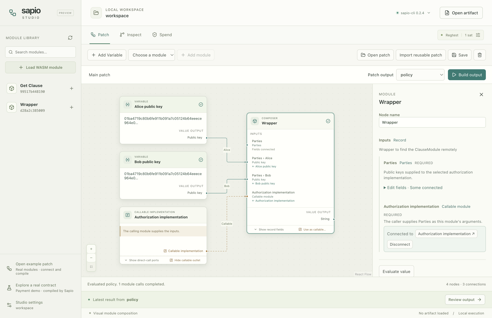

# Sapio Studio

A visual workbench for composing Sapio modules, inspecting contract graphs and
completing explicitly selected spends.

- **Patch:** connect module outputs to compatible JSON inputs, or pass module
  references into Sapio's nested calls. Edit arguments, build a selected result,
  and save the canvas with its exact module hashes and compilation context.
- **Inspect:** open current raw artifacts and explore the graph validated by
  Sapio, including named outputs, transaction proposals, fee constraints and
  covenant assumptions.
- **Spend:** prepare an intent, exchange signing requests and responses, resume
  from files, and finalize through Sapio's checked completion API.

Studio opens without Bitcoin Core or an emulator. Runtime configuration is
needed only for explicit binding. Private keys are selected in native dialogs
and remain outside the renderer.



## Run Studio

Use Node 24 (the version in `.nvmrc`) and npm:

```sh
npm ci
npm run build
npm start
```

For development, `npm run dev` starts Vite and Electron together. Renderer edits
reload automatically; restart the command after changing desktop code.
`npm run dev:web` opens the renderer in a browser for layout development and
read-only preview; desktop file access, compilation and signing use Electron.

Open Settings and select your Sapio CLI executable. Studio requires the current
file-based CLI and Program signer, tested at Sapio revision
[`d385c79e1acb78c42a538f7c503b52efe739ed66`](https://github.com/sapio-lang/sapio/commit/d385c79e1acb78c42a538f7c503b52efe739ed66)
with typed module interfaces. The historical crates.io CLI does not expose
this API. Build the reviewed source with:

```sh
git clone https://github.com/sapio-lang/sapio.git sapio-core
cd sapio-core
git checkout d385c79e1acb78c42a538f7c503b52efe739ed66
cargo build --locked -p sapio-cli
```

Choose `sapio-core/target/debug/sapio-cli` in Studio, or set `SAPIO_CLI_BINARY`
to its absolute path before starting the desktop. The connection check probes
the required commands, because an old and a new CLI may share a version label.

## Try visual composition

Choose **Open example patch** to load and connect the bundled **GetClause** and
**Wrapper** modules. Alice and Bob are named public-key Variables; the
dashed connection supplies the callable implementation. Choose **Build output**
to evaluate the named `policy` output. Sapio executes the real nested WASM
call; the result can be reviewed and exported. The bundled module sources and
checksums are recorded in [the example notes](public/demo/README.md).

Click a module input to enter a structured value, create a matching Variable,
or find compatible outputs and building blocks. Each input shows its source.
Use **Expose as parameter** and **Use as output** to define a reusable interface,
then save it and choose **Import reusable patch** in another program.

You can also load your own `.wasm` modules and connect their advertised APIs.
See [visual patch semantics](docs/PATCHING.md) for the distinction between value
connections and module references, validation, and the current type limits.
Contract outputs use **Compile contract** and offer direct artifact inspection.
Compilation uses the public network, amount and lowering context shown in the
editor. Binding and signing are separate actions.

For a complete contract, use the current CLI's `sapio-cli new` tutorial, then
open its `artifact.json` in Studio. Its `funded.psbt`, `assets.json` and
`evidence.json` feed the Spend view. Save the unchanged artifact and intent
alongside the newest PSBT to resume later. The built-in inspection preview and
starter use synthetic funding and public demonstration keys.

## Checks

```sh
npm run typecheck
npm test
npm run build
npm run test:ui
```

The desktop tests launch the actual production Electron build with an isolated
user-data directory. Linux CI uses Xvfb. To run the real Sapio integration suite,
set `SAPIO_CLI` to the absolute CLI binary and `SAPIO_MODULES` to this checkout's
`public/demo` directory, then run `npm run test:sapio`. The suite creates a
standalone pinned starter with Cargo, completes its synthetic spend, and checks
real nested WASM composition and explicit mock binding. `CARGO_TARGET_DIR` can
reuse an existing Rust build cache.

With `SAPIO_CLI` set, `npm run test:ui` also builds a real visual patch, saves it,
reopens it in a fresh desktop process, and rebuilds from the cached module APIs.
Cold module loading with a debug CLI can take tens of seconds; the desktop shows
the operation in progress while Sapio compiles the WASM.

CI checks Node 24 builds, tests and production desktop startup on Linux and
macOS, plus a pinned Sapio integration job. See [the migration notes](docs/MIGRATION.md)
for the intentionally retired historical surfaces and remaining release work.
